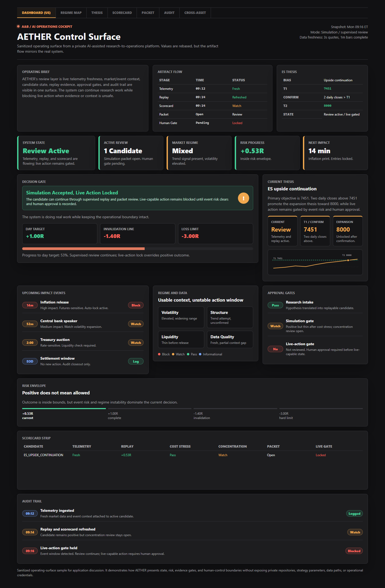

# AETHER Case Study

This repository contains sanitized artifacts from **AETHER**, a private AI-assisted research-to-operations platform I built for a high-stakes decisioning domain.

The private repositories are not public because they contain operational details, data paths, and domain-specific strategy logic. This repo shows the transferable engineering work: evaluation loops, human-in-the-loop gates, auditability, and a control surface for deciding when a system should not act.

## The Short Version

AETHER turns ambiguous hypotheses and noisy local market data into reproducible workflows, compiler blueprints, replay/event artifacts, scorecards, candidate registries, promotion gates, and human-reviewable operator state.

The origin was financial-market research, but the engineering lesson is broader:

> Useful AI is not just about generating ideas. It is about proving which ideas deserve to move forward.

## What This Shows

- Research outputs are separated from operational actions.
- Candidate states are explicit: research-only, review-only, paper-permission, and live approval only by human authority.
- AI-assisted discovery is bounded by schemas, replay, scorecards, promotion packets, and human review.
- The system can kill a promising-sounding candidate when cost-adjusted evidence fails.
- The control surface emphasizes state, risk, market context, gates, next actions, and audit trail instead of a simple performance scoreboard.

## Artifacts

- [Founder-facing case study](./founder-facing-case-study.md)
- [Sanitized promotion packet sample](./sanitized-promotion-packet.md)
- [AETHER control surface](./control-surface.html)

## Control Surface Preview

## Why I Built It This Way

The hard part was not generating ideas. Ideas are cheap.

The hard part was building a system that could answer:

- What data do we actually have?
- What is missing?
- Can this be replayed from artifacts?
- Does it survive costs, stress checks, and holdout rules?
- Is the system allowed to act, or only allowed to recommend?
- Can a human understand why a candidate moved forward or got blocked?
- What should the next research agent do when no candidate is promotable?

That is the part of AI engineering I care about: turning uncertain model-assisted work into useful, reviewable, operationally safe decisions.

## Privacy Boundary

This repo intentionally excludes:

- Source strategy code.
- Private data files.
- Local paths.
- Private repository names.
- Credentials, account details, or operational routing details.
- Proprietary strategy parameters.
